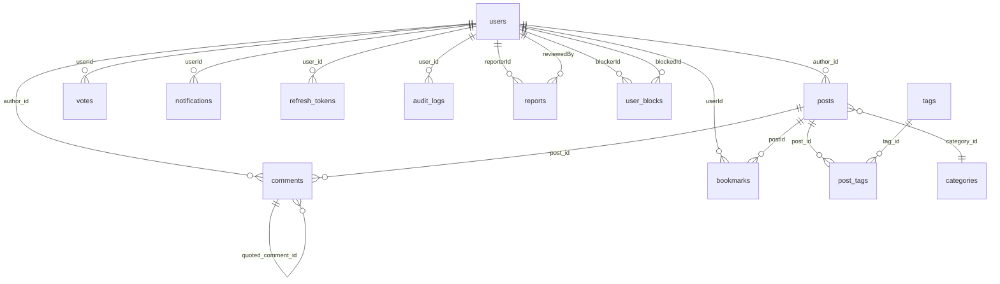

# Database Schema — Mini Forum

> **Version**: v1.25.1  
> **Last Updated**: 2026-03-19

## Mục đích

Tài liệu mô tả chi tiết database schema, quan hệ giữa các bảng, enums, indexes, và hướng dẫn migration.

## Table of Contents

- [1. Tổng Quan](#1-tổng-quan)
- [2. Entity-Relationship Diagram](#2-entity-relationship-diagram)
- [3. Models Chi Tiết](#3-models-chi-tiết)
- [4. Enums](#4-enums)
- [5. Indexes & Constraints](#5-indexes--constraints)
- [6. Seed Data](#6-seed-data)
- [7. Migration Guide](#7-migration-guide)

---

## 1. Tổng Quan

| Metric | Value |
|--------|-------|
| ORM | Prisma 5.22.0 |
| Database | PostgreSQL 15+ |
| Models | 14 |
| Enums | 12 |
| Schema file | `backend/prisma/schema.prisma` |

---

## 2. Entity-Relationship Diagram



---

## 3. Models Chi Tiết

### 3.1 `users` — Người dùng

| Column | Type | Constraints | Mô tả |
|--------|------|-------------|--------|
| id | Int | PK, auto-increment | |
| email | String | **Unique** | Email đăng nhập |
| username | String | **Unique** | Tên đăng nhập |
| password_hash | String | Required | bcrypt hash |
| display_name | String? | | Tên hiển thị |
| avatar_url | String? | | URL avatar |
| bio | String? | | Tiểu sử |
| date_of_birth | DateTime? | | Ngày sinh |
| gender | String? | | Giới tính |
| role | Role | Default: `MEMBER` | Vai trò |
| reputation | Int | Default: `0` | Điểm uy tín |
| is_verified | Boolean | Default: `false` | Email verified |
| is_active | Boolean | Default: `true` | Trạng thái tài khoản |
| last_active_at | DateTime? | | Hoạt động lần cuối |
| username_changed_at | DateTime? | | Lần đổi username gần nhất |
| created_at | DateTime | Default: `now()` | |
| updated_at | DateTime | Auto-update | |

**Relationships**: posts, comments, votes, bookmarks, notifications, refresh_tokens, audit_logs, reports (reporter + reviewer), user_blocks (blocker + blocked)

---

### 3.2 `posts` — Bài viết

| Column | Type | Constraints | Mô tả |
|--------|------|-------------|--------|
| id | Int | PK, auto-increment | |
| title | String | Required | Tiêu đề |
| slug | String | **Unique** | URL-friendly slug |
| content | String | Required | Nội dung (Markdown) |
| excerpt | String? | | Tóm tắt |
| author_id | Int | FK → users | Tác giả |
| category_id | Int | FK → categories | Danh mục |
| view_count | Int | Default: `0` | Lượt xem |
| upvote_count | Int | Default: `0` | Upvote |
| downvote_count | Int | Default: `0` | Downvote |
| comment_count | Int | Default: `0` | Số comment |
| status | PostStatus | Default: `PUBLISHED` | Trạng thái |
| is_pinned | Boolean | Default: `false` | Ghim |
| pin_type | PinType? | | GLOBAL / CATEGORY |
| pin_order | Int | Default: `0` | Thứ tự ghim |
| is_locked | Boolean | Default: `false` | Khóa bình luận |
| created_at | DateTime | Default: `now()` | |
| updated_at | DateTime | Auto-update | |

**Indexes**: `author_id`, `category_id`, `created_at`, `status`, `[is_pinned, pin_order]`

---

### 3.3 `comments` — Bình luận

| Column | Type | Constraints | Mô tả |
|--------|------|-------------|--------|
| id | Int | PK, auto-increment | |
| content | String | Required | Nội dung |
| author_id | Int | FK → users | Tác giả |
| post_id | Int | FK → posts (cascade) | Bài viết |
| parent_id | Int? | FK → comments (self) | Comment cha (nested) |
| quoted_comment_id | Int? | FK → comments (self) | Comment được trích dẫn |
| upvote_count | Int | Default: `0` | |
| downvote_count | Int | Default: `0` | |
| status | CommentStatus | Default: `VISIBLE` | |
| is_edited | Boolean | Default: `false` | Đã chỉnh sửa |
| is_content_masked | Boolean | Default: `false` | Nội dung bị che |
| created_at | DateTime | Default: `now()` | |
| updated_at | DateTime | Auto-update | |

**Indexes**: `author_id`, `parent_id`, `post_id`

---

### 3.4 `categories` — Danh mục

| Column | Type | Constraints | Mô tả |
|--------|------|-------------|--------|
| id | Int | PK, auto-increment | |
| name | String | Required | Tên danh mục |
| slug | String | **Unique** | URL slug |
| description | String? | | Mô tả |
| color | String? | | Mã màu hiển thị |
| sort_order | Int | Default: `0` | Thứ tự sắp xếp |
| post_count | Int | Default: `0` | Counter cache |
| is_active | Boolean | Default: `true` | Hiển thị/ẩn |
| view_permission | PermissionLevel | Default: `ALL` | Ai xem được |
| post_permission | PermissionLevel | Default: `MEMBER` | Ai đăng bài được |
| comment_permission | PermissionLevel | Default: `MEMBER` | Ai bình luận được |
| created_at | DateTime | Default: `now()` | |
| updated_at | DateTime | Auto-update | |

---

### 3.5 `tags` — Thẻ

| Column | Type | Constraints | Mô tả |
|--------|------|-------------|--------|
| id | Int | PK, auto-increment | |
| name | String | Required | Tên tag |
| slug | String | **Unique** | URL slug |
| description | String? | | Mô tả |
| usage_count | Int | Default: `0` | Counter cache |
| use_permission | PermissionLevel | Default: `ALL` | Ai dùng được |
| is_active | Boolean | Default: `true` | |
| created_at | DateTime | Default: `now()` | |
| updated_at | DateTime | Auto-update | |

---

### 3.6 `post_tags` — Many-to-Many: Posts ↔ Tags

| Column | Type | Constraints |
|--------|------|-------------|
| post_id | Int | PK, FK → posts (cascade) |
| tag_id | Int | PK, FK → tags (cascade) |

**Composite PK**: `[post_id, tag_id]`

---

### 3.7 `votes` — Biểu quyết

| Column | Type | Constraints | Mô tả |
|--------|------|-------------|--------|
| id | Int | PK, auto-increment | |
| userId | Int | FK → users (cascade) | Người vote |
| targetType | VoteTarget | Required | POST / COMMENT |
| targetId | Int | Required | ID bài viết hoặc comment |
| value | Int | Required | `1` (upvote) hoặc `-1` (downvote) |
| createdAt | DateTime | Default: `now()` | |
| updatedAt | DateTime | Auto-update | |

**Unique**: `[userId, targetType, targetId]`  
**Indexes**: `[targetType, targetId]`, `userId`

---

### 3.8 `bookmarks` — Đánh dấu

| Column | Type | Constraints |
|--------|------|-------------|
| id | Int | PK, auto-increment |
| userId | Int | FK → users (cascade) |
| postId | Int | FK → posts (cascade) |
| createdAt | DateTime | Default: `now()` |

**Unique**: `[userId, postId]`

---

### 3.9 `notifications` — Thông báo

| Column | Type | Constraints | Mô tả |
|--------|------|-------------|--------|
| id | Int | PK, auto-increment | |
| userId | Int | FK → users (cascade) | Người nhận |
| type | NotificationType | Required | Loại thông báo |
| title | String | Required | Tiêu đề |
| content | String | Required | Nội dung |
| relatedId | Int? | | ID liên quan |
| relatedType | String? | | Loại liên quan |
| isRead | Boolean | Default: `false` | Đã đọc |
| deleted_at | DateTime? | | Soft delete |
| createdAt | DateTime | Default: `now()` | |

**Indexes**: `[userId, deleted_at]`, `[userId, isRead]`

---

### 3.10 `reports` — Báo cáo vi phạm

| Column | Type | Constraints | Mô tả |
|--------|------|-------------|--------|
| id | Int | PK, auto-increment | |
| reporterId | Int | FK → users (cascade) | Người báo cáo |
| targetType | ReportTarget | Required | USER / POST / COMMENT |
| targetId | Int | Required | ID đối tượng bị báo cáo |
| reason | String | Required | Lý do |
| description | String? | | Chi tiết |
| status | ReportStatus | Default: `PENDING` | Trạng thái xử lý |
| reviewedBy | Int? | FK → users | Người xem xét |
| reviewedAt | DateTime? | | Thời gian xem xét |
| reviewNote | String? | | Ghi chú xem xét |
| createdAt | DateTime | Default: `now()` | |
| updatedAt | DateTime | Auto-update | |

**Indexes**: `reporterId`, `status`, `[targetType, targetId]`

---

### 3.11 `user_blocks` — Chặn người dùng

| Column | Type | Constraints |
|--------|------|-------------|
| id | Int | PK, auto-increment |
| blockerId | Int | FK → users (cascade) |
| blockedId | Int | FK → users (cascade) |
| createdAt | DateTime | Default: `now()` |

**Unique**: `[blockerId, blockedId]`

---

### 3.12 `refresh_tokens` — Token làm mới

| Column | Type | Constraints |
|--------|------|-------------|
| id | Int | PK, auto-increment |
| token | String | **Unique** |
| user_id | Int | FK → users (cascade) |
| expires_at | DateTime | Thời gian hết hạn |
| created_at | DateTime | Default: `now()` |

**Indexes**: `token`, `user_id`

---

### 3.13 `audit_logs` — Nhật ký hệ thống

| Column | Type | Constraints | Mô tả |
|--------|------|-------------|--------|
| id | Int | PK, auto-increment | |
| user_id | Int | FK → users (cascade) | Người thực hiện |
| action | AuditAction | Required | Hành động |
| targetType | AuditTarget | Required | Đối tượng |
| target_id | Int? | | ID đối tượng |
| target_name | String? | | Tên đối tượng (snapshot) |
| old_value | String? | | Giá trị cũ (JSON) |
| new_value | String? | | Giá trị mới (JSON) |
| ip_address | String? | | IP address |
| user_agent | String? | | User Agent |
| created_at | DateTime | Default: `now()` | |

**Indexes**: `action`, `created_at`, `[targetType, target_id]`, `user_id`

---

### 3.14 `otp_tokens` — Mã xác thực OTP

| Column | Type | Constraints | Mô tả |
|--------|------|-------------|--------|
| id | Int | PK, auto-increment | |
| email | String | Required | Email nhận OTP |
| purpose | OtpPurpose | Required | REGISTER / RESET_PASSWORD |
| code | String | Required | OTP 6 số (đã hash) |
| verification_token | String | Required | Token 32-byte hex |
| is_verified | Boolean | Default: `false` | Đã xác thực |
| verified_at | DateTime? | | Thời gian xác thực |
| attempts_made | Int | Default: `0` | Số lần thử |
| max_attempts | Int | Default: `5` | Giới hạn thử |
| expires_at | DateTime | Required | Thời gian hết hạn |
| created_at | DateTime | Default: `now()` | |
| updated_at | DateTime | Auto-update | |

**Indexes**: `email`, `[email, purpose]`

---

## 4. Enums

### 4.1 Role — Vai trò người dùng

| Value | Mô tả |
|-------|--------|
| `MEMBER` | Thành viên (default) |
| `MODERATOR` | Người kiểm duyệt |
| `ADMIN` | Quản trị viên |

### 4.2 PostStatus — Trạng thái bài viết

| Value | Mô tả |
|-------|--------|
| `DRAFT` | Bản nháp |
| `PUBLISHED` | Đã xuất bản |
| `HIDDEN` | Bị ẩn (mod/admin) |
| `DELETED` | Đã xóa |

### 4.3 CommentStatus — Trạng thái bình luận

| Value | Mô tả |
|-------|--------|
| `VISIBLE` | Hiển thị |
| `HIDDEN` | Bị ẩn |
| `DELETED` | Đã xóa |

### 4.4 ReportStatus — Trạng thái báo cáo

| Value | Mô tả |
|-------|--------|
| `PENDING` | Chờ xử lý |
| `REVIEWING` | Đang xem xét |
| `RESOLVED` | Đã giải quyết |
| `DISMISSED` | Bác bỏ |

### 4.5 ReportTarget — Đối tượng báo cáo

| Value |
|-------|
| `USER` |
| `POST` |
| `COMMENT` |

### 4.6 VoteTarget — Đối tượng vote

| Value |
|-------|
| `POST` |
| `COMMENT` |

### 4.7 NotificationType — Loại thông báo

| Value | Mô tả |
|-------|--------|
| `COMMENT` | Có comment mới trên bài viết |
| `REPLY` | Có reply cho comment |
| `MENTION` | Được nhắc đến |
| `UPVOTE` | Được upvote |
| `SYSTEM` | Thông báo hệ thống |

### 4.8 PermissionLevel — Cấp quyền

| Value | Mô tả |
|-------|--------|
| `ALL` | Tất cả (bao gồm Guest) |
| `MEMBER` | Thành viên trở lên |
| `MODERATOR` | Moderator trở lên |
| `ADMIN` | Chỉ Admin |

### 4.9 PinType — Loại ghim

| Value | Mô tả |
|-------|--------|
| `GLOBAL` | Ghim trên toàn forum |
| `CATEGORY` | Ghim trong danh mục |

### 4.10 AuditAction — Hành động audit

| Value | Mô tả |
|-------|--------|
| `CREATE` | Tạo mới |
| `UPDATE` | Cập nhật |
| `DELETE` | Xóa |
| `LOGIN` | Đăng nhập |
| `LOGOUT` | Đăng xuất |
| `PIN` / `UNPIN` | Ghim / Bỏ ghim |
| `LOCK` / `UNLOCK` | Khóa / Mở khóa |
| `HIDE` / `SHOW` | Ẩn / Hiện |
| `BAN` / `UNBAN` | Ban / Unban |
| `ROLE_CHANGE` | Đổi vai trò |
| `VIEW_MASKED_CONTENT` | Xem nội dung bị che |

### 4.11 AuditTarget — Đối tượng audit

| Value |
|-------|
| `USER` |
| `POST` |
| `COMMENT` |
| `CATEGORY` |
| `TAG` |
| `REPORT` |
| `SETTINGS` |

### 4.12 OtpPurpose — Mục đích OTP

| Value | Mô tả |
|-------|--------|
| `REGISTER` | Đăng ký tài khoản mới |
| `RESET_PASSWORD` | Đặt lại mật khẩu |

---

## 5. Indexes & Constraints

### 5.1 Unique Constraints

| Table | Columns | Mục đích |
|-------|---------|---------|
| users | `email` | 1 email / tài khoản |
| users | `username` | 1 username duy nhất |
| posts | `slug` | SEO-friendly URL |
| categories | `slug` | URL slug |
| tags | `slug` | URL slug |
| refresh_tokens | `token` | Lookup nhanh |
| bookmarks | `[userId, postId]` | 1 bookmark / user / post |
| votes | `[userId, targetType, targetId]` | 1 vote / user / target |
| user_blocks | `[blockerId, blockedId]` | 1 block record |
| post_tags | `[post_id, tag_id]` | Composite PK |

### 5.2 Cascade Deletes

Khi xóa user (hard delete), các record liên quan tự động bị xóa:

| Parent | Child |
|--------|-------|
| users | bookmarks, notifications, refresh_tokens, audit_logs, reports (reporter), user_blocks |
| posts | comments, bookmarks, post_tags |
| tags | post_tags |

> **Lưu ý**: `posts` và `comments` **KHÔNG cascade delete** khi xóa user — tránh mất nội dung do thay đổi trạng thái user.

---

## 6. Seed Data

Seed file: `backend/prisma/seed.ts`

### Test Accounts

| Email | Password | Role | Username |
|-------|----------|------|----------|
| admin@forum.com | Admin@123 | ADMIN | admin |

> **Lưu ý**: Seed hiện tại chỉ tạo tài khoản Admin. Các dữ liệu mẫu khác (categories, tags, posts, comments...) được định nghĩa nhưng bị skip (`return` sớm) trong code.

**Chạy seed**:
```bash
cd backend
npx prisma db seed
```

---

## 7. Migration Guide

### 7.1 Tạo migration mới

```bash
cd backend
npx prisma migrate dev --name <tên_migration>
```

### 7.2 Apply migration (production)

```bash
npx prisma migrate deploy
```

### 7.3 Reset database

```bash
# Reset hoàn toàn (XÓA tất cả data)
npx prisma migrate reset

# Hoặc dùng script clear data
npx ts-node scripts/clearData.ts
```

### 7.4 Prisma Studio (GUI)

```bash
npx prisma studio
# Opens at http://localhost:5555
```

---

**Xem thêm**:
- [Architecture](./01-ARCHITECTURE.md)
- [API Reference](./03-API/)
- [Backend Development Guide](../backend/README.md)
