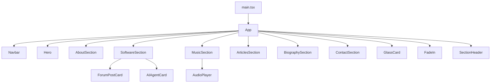

# Đặc tả Frontend - RBPWeb

## 1. Tổng quan dự án

### Mục đích của frontend
Frontend trong thư mục RBPWeb là một ứng dụng React/Vite đơn trang dùng để trình bày một portfolio cá nhân theo phong cách hiện đại, có chủ đề âm nhạc và kỹ thuật phần mềm. Theo codebase hiện có, ứng dụng chủ yếu phục vụ mục đích hiển thị nội dung tĩnh và tương tác nhẹ ở phía client.

### Chức năng chính
Theo code hiện có, frontend cung cấp các chức năng sau:
- Hiển thị các section chính: Hero, About, Software, Music, Articles, Biography, Contact.
- Chuyển đổi ngôn ngữ giữa tiếng Anh và tiếng Việt.
- Bật/tắt nhạc môi trường bằng nút trên navbar.
- Theo dõi section đang ở viewport để làm nổi bật mục điều hướng.
- Tải dữ liệu bài viết diễn đàn từ API JSONPlaceholder qua fetch ở client.
- Mô phỏng quy trình AI agent bằng trạng thái UI và thời gian chờ giả lập.
- Phát âm thanh demo bằng audio player cục bộ.
- Sao chép email vào clipboard.

### Công nghệ sử dụng
Dựa trên file cấu hình và mã nguồn, frontend sử dụng:
- React 18.3.1
- Vite 6.3.5
- TypeScript
- Tailwind CSS 4.1.12
- Motion (thư viện animation)
- Lucide React cho icon
- MUI/Emotion (có trong package.json, nhưng hiện tại không thấy dùng trực tiếp trong RBPWeb/src)
- Radix UI và các component UI wrapper trong thư mục src/app/components/ui
- React Router: Không xác định từ codebase

---

## 2. Kiến trúc frontend

### Cấu trúc thư mục

```text
RBPWeb/
├── index.html
├── package.json
├── pnpm-workspace.yaml
├── postcss.config.mjs
├── vite.config.ts
├── src/
│   ├── main.tsx
│   ├── app/
│   │   ├── App.tsx
│   │   └── components/
│   │       ├── figma/
│   │       │   └── ImageWithFallback.tsx
│   │       └── ui/
│   │           ├── accordion.tsx
│   │           ├── alert-dialog.tsx
│   │           ├── alert.tsx
│   │           ├── aspect-ratio.tsx
│   │           ├── avatar.tsx
│   │           ├── badge.tsx
│   │           ├── breadcrumb.tsx
│   │           ├── button.tsx
│   │           ├── calendar.tsx
│   │           ├── card.tsx
│   │           ├── carousel.tsx
│   │           ├── chart.tsx
│   │           ├── checkbox.tsx
│   │           ├── collapsible.tsx
│   │           ├── command.tsx
│   │           ├── context-menu.tsx
│   │           ├── dialog.tsx
│   │           ├── drawer.tsx
│   │           ├── dropdown-menu.tsx
│   │           ├── form.tsx
│   │           ├── hover-card.tsx
│   │           ├── input-otp.tsx
│   │           ├── input.tsx
│   │           ├── label.tsx
│   │           ├── menubar.tsx
│   │           ├── navigation-menu.tsx
│   │           ├── pagination.tsx
│   │           ├── popover.tsx
│   │           ├── progress.tsx
│   │           ├── radio-group.tsx
│   │           ├── resizable.tsx
│   │           ├── scroll-area.tsx
│   │           ├── select.tsx
│   │           ├── separator.tsx
│   │           ├── sheet.tsx
│   │           ├── sidebar.tsx
│   │           ├── skeleton.tsx
│   │           ├── slider.tsx
│   │           ├── sonner.tsx
│   │           ├── switch.tsx
│   │           ├── table.tsx
│   │           ├── tabs.tsx
│   │           ├── textarea.tsx
│   │           ├── toggle-group.tsx
│   │           ├── toggle.tsx
│   │           ├── tooltip.tsx
│   │           └── utils.ts
│   └── styles/
│       ├── fonts.css
│       ├── globals.css
│       ├── index.css
│       ├── tailwind.css
│       └── theme.css
```

### Tổ chức module
- Ứng dụng hiện tại chủ yếu là một file duy nhất: [RBPWeb/src/app/App.tsx](RBPWeb/src/app/App.tsx).
- Các thành phần UI chung như GlassCard, FadeIn, SectionHeader được định nghĩa trực tiếp trong file này.
- Các component UI dùng lại nằm trong [RBPWeb/src/app/components/ui](RBPWeb/src/app/components/ui).
- Không thấy module-level state management như Redux, Zustand, Context API riêng biệt; state chủ yếu được quản lý bằng React useState trong component App và các subcomponent cục bộ.

### Routing
- Không xác định từ codebase.
- Không thấy cấu hình router như React Router, createBrowserRouter hoặc Routes/Route trong RBPWeb/src.
- Ứng dụng hoạt động như một single-page experience, với các section được render liên tục trong một component App duy nhất.

### Layout
- Layout là một single-page layout với header cố định, main section và nền hình ảnh toàn màn hình.
- Navbar ở đầu trang dùng để điều hướng nội dung bằng scroll tới section tương ứng.

### Thiết kế component
- Component sử dụng phong cách “section-based” và “composition-based”.
- Các thành phần nhỏ như FadeIn, GlassCard, SectionHeader được định nghĩa như helper component.
- Các section lớn như Hero, AboutSection, SoftwareSection, MusicSection, ArticlesSection, BiographySection, ContactSection được tách thành các hàm component riêng.

---

## 3. Các trang (Pages)

> Trong codebase hiện tại, không có phân chia route/page theo router. Các “page” ở đây được hiểu là các section chính trong một single-page app.

| Trang/Section | Mục đích | Route | Thành phần chính | Luồng điều hướng | API sử dụng | Điều kiện hiển thị | Trạng thái |
|---|---|---|---|---|---|---|---|
| Hero | Hiển thị lời chào và CTA ban đầu | Không xác định | Hero | Scroll tới section khác khi nhấn nút | Không | Luôn hiển thị | Không có trạng thái loading/error |
| About | Trình bày thông tin cá nhân và sở thích | Không xác định | AboutSection | Không có điều hướng nội bộ | Không | Luôn hiển thị | Không có trạng thái loading/error |
| Software | Hiển thị kỹ năng, dự án và tích hợp trực tiếp | Không xác định | SoftwareSection | Scroll tới các phần khác qua navbar | Fetch API cho forum post, UI giả lập AI | Luôn hiển thị | Loading, Error, Completed cho card AI và forum |
| Music | Trình bày sản phẩm âm nhạc và audio demo | Không xác định | MusicSection, AudioPlayer | Không có điều hướng nội bộ | Không | Luôn hiển thị | Audio player có state playing/progress |
| Articles | Hiển thị bài viết mẫu | Không xác định | ArticlesSection | Không có điều hướng nội bộ | Không | Luôn hiển thị | Không có trạng thái loading/error |
| Biography | Trình bày tiểu sử theo dòng thời gian | Không xác định | BiographySection | Không có điều hướng nội bộ | Không | Luôn hiển thị | Không có trạng thái loading/error |
| Contact | Hiển thị thông tin liên hệ và sao chép email | Không xác định | ContactSection | Không có điều hướng nội bộ | Không | Luôn hiển thị | Copied state ngắn hạn |

### Chi tiết từng section

#### Hero
- File: [RBPWeb/src/app/App.tsx](RBPWeb/src/app/App.tsx)
- Mục đích: giới thiệu cá nhân và chuyển đến các action chính.
- Thành phần chính: Hero, FadeIn, button CTA.
- Luồng điều hướng: nhấn vào Projects/Contact sẽ scroll tới section tương ứng.
- API: Không sử dụng.
- Điều kiện hiển thị: luôn hiện.
- Trạng thái: Không xác định từ codebase.

#### About
- File: [RBPWeb/src/app/App.tsx](RBPWeb/src/app/App.tsx)
- Mục đích: hiển thị thông tin học vấn, sở thích, focus và câu trích dẫn.
- Thành phần chính: AboutSection, GlassCard, SectionHeader.
- Luồng điều hướng: không có.
- API: Không sử dụng.
- Điều kiện hiển thị: luôn hiện.
- Trạng thái: Không xác định từ codebase.

#### Software
- File: [RBPWeb/src/app/App.tsx](RBPWeb/src/app/App.tsx)
- Mục đích: cho thấy kỹ năng kỹ thuật, các dự án và hai component tương tác.
- Thành phần chính: SoftwareSection, ForumPostCard, AIAgentCard.
- Luồng điều hướng: navbar và CTA scroll tới section này.
- API: gọi đến https://jsonplaceholder.typicode.com/posts/{id} trong ForumPostCard.
- Điều kiện hiển thị: luôn hiện.
- Trạng thái:
  - ForumPostCard: loading, error, post loaded
  - AIAgentCard: idle, selecting, gathering, generating, publishing, completed

#### Music
- File: [RBPWeb/src/app/App.tsx](RBPWeb/src/app/App.tsx)
- Mục đích: trình bày thông tin sản xuất âm nhạc, featured works, audio demo và tài nguyên.
- Thành phần chính: MusicSection, AudioPlayer.
- Luồng điều hướng: không có điều hướng nội bộ.
- API: Không sử dụng.
- Điều kiện hiển thị: luôn hiện.
- Trạng thái: audio player có playing/progress.

#### Articles
- File: [RBPWeb/src/app/App.tsx](RBPWeb/src/app/App.tsx)
- Mục đích: hiển thị danh sách bài viết dạng card.
- Thành phần chính: ArticlesSection.
- Luồng điều hướng: không có điều hướng nội bộ.
- API: Không sử dụng.
- Điều kiện hiển thị: luôn hiện.
- Trạng thái: Không xác định từ codebase.

#### Biography
- File: [RBPWeb/src/app/App.tsx](RBPWeb/src/app/App.tsx)
- Mục đích: thể hiện timeline cá nhân.
- Thành phần chính: BiographySection.
- Luồng điều hướng: không có.
- API: Không sử dụng.
- Điều kiện hiển thị: luôn hiện.
- Trạng thái: Không xác định từ codebase.

#### Contact
- File: [RBPWeb/src/app/App.tsx](RBPWeb/src/app/App.tsx)
- Mục đích: cung cấp thông tin để liên hệ.
- Thành phần chính: ContactSection.
- Luồng điều hướng: không có.
- API: Không sử dụng.
- Điều kiện hiển thị: luôn hiện.
- Trạng thái: copied state.

---

## 4. Components

### Component quan trọng

#### App
- File: [RBPWeb/src/app/App.tsx](RBPWeb/src/app/App.tsx)
- Chức năng: component gốc, quản lý state chung: lang, musicOn, activeSection.
- Props: không có props.
- Dữ liệu sử dụng: translation object T, dữ liệu tĩnh như PROJECTS, FEATURED_WORKS, AUDIO_DEMOS, RESOURCES, ARTICLES.
- Component con: Navbar, Hero, AboutSection, SoftwareSection, MusicSection, ArticlesSection, BiographySection, ContactSection.
- Sự kiện và hành vi:
  - đọc localStorage cho lang và musicOn khi mount
  - thiết lập IntersectionObserver để theo dõi section đang active
  - render tất cả section trong một layout duy nhất

#### Navbar
- File: [RBPWeb/src/app/App.tsx](RBPWeb/src/app/App.tsx)
- Chức năng: điều hướng giữa các section và thay đổi ngôn ngữ/nhạc môi trường.
- Props:
  - lang: Lang
  - setLang: (l: Lang) => void
  - musicOn: boolean
  - setMusicOn: (v: boolean) => void
  - activeSection: string
- Dữ liệu sử dụng: T[lang].navLinks
- Component con: không có component con rõ ràng.
- Sự kiện và hành vi:
  - click vào mục navbar sẽ scroll tới section tương ứng
  - mở/đóng menu mobile
  - toggle language và ambient music

#### AudioPlayer
- File: [RBPWeb/src/app/App.tsx](RBPWeb/src/app/App.tsx)
- Chức năng: phát audio demo và hiển thị tiến trình phát.
- Props: title, genre, duration, src, imgId.
- Dữ liệu sử dụng: local state playing và progress, ref tới HTMLAudioElement.
- Component con: none.
- Sự kiện và hành vi:
  - toggle play/pause
  - cập nhật progress khi audio đang phát
  - reset progress khi kết thúc

#### ForumPostCard
- File: [RBPWeb/src/app/App.tsx](RBPWeb/src/app/App.tsx)
- Chức năng: lấy dữ liệu bài viết diễn đàn từ API bên ngoài và render UI trạng thái.
- Props: lang.
- Dữ liệu sử dụng: state post, loading, error.
- Component con: GlassCard.
- Sự kiện và hành vi:
  - fetch data khi component mount
  - refresh bài viết khi click button
  - render loading, error, content

#### AIAgentCard
- File: [RBPWeb/src/app/App.tsx](RBPWeb/src/app/App.tsx)
- Chức năng: mô phỏng UI quy trình AI agent.
- Props: lang.
- Dữ liệu sử dụng: state stage, generatedTitle.
- Component con: motion div, AnimatePresence.
- Sự kiện và hành vi:
  - chạy sequence trạng thái với sleep giả lập
  - đổi trạng thái theo từng bước
  - hiển thị title đã tạo ở cuối tiến trình

#### GlassCard
- File: [RBPWeb/src/app/App.tsx](RBPWeb/src/app/App.tsx)
- Chức năng: wrapper UI dùng chung cho card với nền trong suốt, blur và border.
- Props: children, className, hover.
- Dữ liệu sử dụng: không có state.
- Component con: none.
- Sự kiện và hành vi: không có.

#### FadeIn
- File: [RBPWeb/src/app/App.tsx](RBPWeb/src/app/App.tsx)
- Chức năng: wrapper animation khi element vào viewport.
- Props: children, delay, className.
- Dữ liệu sử dụng: không có state.
- Component con: none.
- Sự kiện và hành vi: dùng motion animation.

---

## 5. Luồng dữ liệu

### State Management
- Không dùng Redux, Zustand, MobX hoặc thư viện state management chuyên dụng.
- State chủ yếu lưu trong React local state bằng useState.

### Context
- Không xác định từ codebase.
- Không thấy implementation của React Context.

### React Query / SWR
- Không xác định từ codebase.
- Dữ liệu API được lấy bằng fetch trực tiếp trong component local.

### Local State
Các state chính:
- lang: trạng thái ngôn ngữ trong App
- musicOn: trạng thái bật/tắt cảm giác âm nhạc môi trường
- activeSection: section hiện tại đang ở viewport
- post/loading/error trong ForumPostCard
- stage/generatedTitle trong AIAgentCard
- playing/progress trong AudioPlayer
- copied trong ContactSection

### Luồng dữ liệu giữa các component
- Dữ liệu tĩnh được định nghĩa ở top-level trong App.tsx và được truyền vào các section bằng props hoặc được dùng trực tiếp trong component cùng file.
- State lang và musicOn được truyền từ App xuống Navbar và các section con.
- State locale được persisted vào localStorage.

---

## 6. Tích hợp Backend

### Danh sách endpoint
- GET https://jsonplaceholder.typicode.com/posts/{id}
  - Được dùng trong [RBPWeb/src/app/App.tsx](RBPWeb/src/app/App.tsx) trong ForumPostCard.

### Cách gọi API
- Sử dụng fetch API của browser.
- Gọi bằng async/await.
- Không dùng axios hoặc thư viện HTTP riêng.

### Authentication
- Không xác định từ codebase.
- Không thấy token, session, auth header hoặc login flow.

### Error Handling
- Trong ForumPostCard, lỗi fetch sẽ đặt state error=true và render thông báo lỗi.
- Không thấy retry policy phức tạp.

### Retry
- Không xác định từ codebase.
- Không thấy logic retry hoặc exponential backoff.

### Loading
- Có loading state trong ForumPostCard và AIAgentCard.
- Loading UI được render bằng skeleton-style bars và spinner.

---

## 7. Quản lý tài nguyên

### Hình ảnh
- Hình ảnh chủ yếu lấy từ Unsplash qua URL động dựa trên imgId.
- Một số ảnh được dùng làm background hoặc thumbnail.
- Một component helper ImageWithFallback tồn tại tại [RBPWeb/src/app/components/figma/ImageWithFallback.tsx](RBPWeb/src/app/components/figma/ImageWithFallback.tsx), nhưng hiện tại không thấy được dùng trong App.tsx.

### Video
- Không xác định từ codebase.
- Trong UI có các card YouTube nhưng chưa có link video thật; href đều là #.

### Audio
- Audio demo dùng nguồn MP3 từ soundhelix.com trong [RBPWeb/src/app/App.tsx](RBPWeb/src/app/App.tsx).
- Audio player có state play/pause và progress.

### Font
- Font được import từ Google Fonts trong [RBPWeb/src/styles/fonts.css](RBPWeb/src/styles/fonts.css): Gilda Display, Jost, JetBrains Mono.

### File tĩnh
- Không thấy thư mục assets riêng cho hình ảnh/tài nguyên local trong RBPWeb/src ngoài các CSS và component UI.

---

## 8. Responsive Design
- Sử dụng utility class Tailwind như md:, sm:, lg:, grid, flex.
- Navbar có hành vi khác nhau giữa desktop và mobile (ẩn nav desktop, hiện menu mobile).
- Section layout chuyển từ 1 cột sang nhiều cột ở các breakpoint khác nhau.
- Không thấy breakpoint tuỳ chỉnh riêng ngoài các class mặc định của Tailwind.

---

## 9. Accessibility
- Có aria-label trên một số button như nút toggle audio và nút copy email.
- Một số hình ảnh có alt text.
- Nút và link có style hover/focus rõ ràng ở mức cơ bản.
- Không thấy implementation của keyboard navigation nâng cao hoặc focus trap.
- Không thấy test accessibility hoặc aria pattern phức tạp.

---

## 10. Performance

### Lazy Loading
- Không xác định từ codebase.
- Không có lazy() hoặc dynamic import cho section/component.

### Code Splitting
- Không xác định từ codebase.
- Toàn bộ UI được render trong một file App.tsx duy nhất.

### Memoization
- Không xác định từ codebase.
- Không thấy React.memo, useMemo, useDeferredValue.

### Caching
- Chỉ có localStorage cho preference ngôn ngữ và trạng thái âm nhạc.
- Không thấy cache cho API response hoặc resource loader.

### Virtualization
- Không xác định từ codebase.
- Không có list dài cần virtualization.

---

## 11. Phụ thuộc giữa các module



---

## 12. Quy ước của dự án

### Cách đặt tên
- Component và hàm component sử dụng PascalCase như Hero, AboutSection, Navbar, AudioPlayer.
- Helper function và biến nội bộ dùng camelCase như fetchPost, handleSetLang.
- Type và interface dùng PascalCase như Lang, ForumPost, AIStage.

### Cấu trúc thư mục
- Component UI chung nằm trong thư mục [RBPWeb/src/app/components/ui](RBPWeb/src/app/components/ui).
- File App chính nằm ở [RBPWeb/src/app/App.tsx](RBPWeb/src/app/App.tsx).
- Style tập trung trong [RBPWeb/src/styles](RBPWeb/src/styles).

### Pattern đang sử dụng
- Component-based composition.
- Inline data definitions tại top-level file.
- Local state management bằng useState.
- CSS utility-first via Tailwind.

---

## 13. Các điểm nổi bật về kiến trúc
- Frontend là một single-page portfolio, không dùng router.
- Tất cả nội dung chính được render trong một component App duy nhất.
- UI được tổ chức theo section và helper component để tái sử dụng.
- Có tích hợp client-side fetch và animation nhẹ.
- Có thể chạy trực tiếp bằng Vite mà không cần backend riêng.

---

## 14. Các vấn đề hoặc điểm có thể cải thiện
- Không có routing thực sự; nếu cần mở rộng thành nhiều page thì cần thiết kế router.
- Logic nằm tập trung trong một file lớn [RBPWeb/src/app/App.tsx](RBPWeb/src/app/App.tsx), khiến bảo trì khó hơn.
- Không có state management tập trung cho dữ liệu phức tạp.
- API gọi trực tiếp trong component với error/retry hạn chế.
- Không có lazy loading hoặc code splitting cho các section lớn.
- Một số link và href hiện đang dùng #, nên chưa có target thực tế.
- Component UI trong [RBPWeb/src/app/components/ui](RBPWeb/src/app/components/ui) tồn tại nhưng chưa thấy được sử dụng trực tiếp trong App.tsx.

---

## 15. Ghi chú về thông tin không xác định từ codebase
- Routing thực tế: Không xác định từ codebase.
- Authentication: Không xác định từ codebase.
- State management library: Không xác định từ codebase.
- Backend API khác ngoài JSONPlaceholder: Không xác định từ codebase.
- Lazy loading và code splitting: Không xác định từ codebase.
