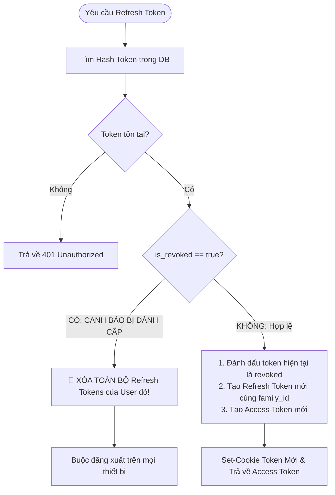

# TÀI LIỆU ĐẶC TẢ KỸ THUẬT: BẢO MẬT XÁC THỰC VÀ BẢO VỆ DỮ LIỆU (AUTH SECURITY SPEC)

## 📌 Tổng quan lộ trình triển khai

```mermaid
gantt
    title Thứ tự triển khai các giai đoạn (Implementation Roadmap)
    dateFormat  YYYY-MM-DD
    section Giai đoạn 1 (Core Fix)
    Phase 1: Chuyển Token sang HttpOnly Cookie + In-Memory RAM :done, p1, 2026-10-01, 2d
    section Giai đoạn 2 (Data Privacy)
    Phase 2: Dọn dẹp PII & Loại bỏ Cache user ở localStorage   :done, p2, after p1, 1d
    section Giai đoạn 3 (Token Security)
    Phase 3: Triển khai Refresh Token Rotation & Reuse Detection: done, p3, after p2, 2d
    section Giai đoạn 4 (Hardening)
    Phase 4: Gia cố CSP & Rà soát XSS Sanitization            : active, p4, after p3, 2d
```

---

## 🚀 GIAI ĐOẠN 1: Vá khẩn cấp cơ chế lưu trữ Token (In-Memory Access Token + HttpOnly Cookie)
> **Mục tiêu**: Loại bỏ 100% việc lưu `forum_access_token` và `forum_refresh_token` trong `localStorage`. JavaScript không thể đọc được Refresh Token.

### 1.1. Backend Specification
* **File cần sửa**: [`backend/src/controllers/authController.ts`](file:///e:/TT/mini-forum/backend/src/controllers/authController.ts)
* **Yêu cầu kỹ thuật**:
  1. Khi `login`, `register`, `refresh`: Chỉ set `refreshToken` vào **HttpOnly Cookie**.
  2. **Xóa `refreshToken` ra khỏi JSON Response Body** (chỉ trả về `accessToken` và `user`).

```typescript
// backend/src/controllers/authController.ts
export async function login(req: Request, res: Response, next: NextFunction): Promise<void> {
  try {
    const data = req.body as LoginInput;
    const result = await authService.login(data);

    // 1. Set HttpOnly Cookie (Đã có hàm setRefreshCookie)
    setRefreshCookie(res, result.tokens.refreshToken);

    // 2. CHỈ TRẢ VỀ accessToken (KHÔNG trả refreshToken trong body)
    const responsePayload = {
      user: result.user,
      accessToken: result.tokens.accessToken, // Chỉ trả accessToken
    };

    sendSuccess(res, responsePayload, 'Login successful');
  } catch (error) {
    next(error);
  }
}
```

---

### 1.2. Frontend Specification
* **File cần sửa**: 
  - [`frontend/src/api/axios.ts`](file:///e:/TT/mini-forum/frontend/src/api/axios.ts)
  - [`frontend/src/contexts/AuthContext.tsx`](file:///e:/TT/mini-forum/frontend/src/contexts/AuthContext.tsx)
* **Yêu cầu kỹ thuật**:
  1. Bật `withCredentials: true` trong Axios instance để tự động gửi `HttpOnly Cookie` lên BE.
  2. Tạo biến `inMemoryAccessToken` (lưu trong biến module / RAM), cung cấp hàm `setAccessToken(token)` và `getAccessToken()`.
  3. Xóa bỏ hoàn toàn các key `forum_access_token` và `forum_refresh_token` khỏi `localStorage`.
  4. Cơ chế khôi phục phiên (Silent Refresh on App Init): Khi khởi động app (hoặc F5), gọi API `POST /api/v1/auth/refresh` để lấy `accessToken` mới vào RAM.

```typescript
// frontend/src/api/axios.ts

let inMemoryAccessToken: string | null = null;

export const setAccessToken = (token: string | null) => {
  inMemoryAccessToken = token;
};

export const getAccessToken = (): string | null => {
  return inMemoryAccessToken;
};

export const clearTokens = () => {
  inMemoryAccessToken = null;
  // Dọn dẹp tàn dư nếu có
  localStorage.removeItem('forum_access_token');
  localStorage.removeItem('forum_refresh_token');
};

export const apiClient = axios.create({
  baseURL: API_BASE_URL,
  timeout: 30000,
  withCredentials: true, // BẮT BUỘC: để trình duyệt tự đính kèm cookie HttpOnly
});
```

* **Acceptance Criteria (DoD)**:
  * [x] Mở DevTools -> Application -> Local Storage: Không còn thấy `forum_access_token` và `forum_refresh_token`.
  * [x] Tab Network: Thấy cookie `refresh_token` có cờ `HttpOnly`, `SameSite=Strict`, `Secure`.
  * [x] F5 trang web vẫn giữ được trạng thái đăng nhập (nhờ Silent Refresh).

---

## 🧹 GIAI ĐOẠN 2: Dọn dẹp PII & Loại bỏ Cache User ở `localStorage`
> **Mục tiêu**: Bảo vệ thông tin cá nhân (PII), ngăn chặn việc lộ thông tin Admin/User khi mở DevTools hoặc máy dùng chung.

### 2.1. Backend Specification
* **File cần sửa**: [`backend/src/services/authService.ts`](file:///e:/TT/mini-forum/backend/src/services/authService.ts)
* **Yêu cầu kỹ thuật**:
  * Chuẩn hóa `AuthUserDTO` chỉ trả về các trường cần thiết phục vụ UI: `id`, `username`, `display_name`, `avatar_preview_url`, `avatar_standard_url`, `role`.
  * Dữ liệu cá nhân chi tiết (`date_of_birth`, `gender`,...) chỉ trả về khi người dùng vào đúng trang Profile Settings (`/api/v1/users/me/profile`).

---

### 2.2. Frontend Specification
* **File cần sửa**: [`frontend/src/contexts/AuthContext.tsx`](file:///e:/TT/mini-forum/frontend/src/contexts/AuthContext.tsx)
* **Yêu cầu kỹ thuật**:
  1. Xóa bỏ `localStorage.setItem('forum_auth_user', ...)` và `localStorage.getItem('forum_auth_user')`.
  2. Toàn bộ `user` state chỉ lưu trong **React AuthContext (RAM)**.
  3. Khi App khởi động:
     ```typescript
     // frontend/src/contexts/AuthContext.tsx
     useEffect(() => {
       const initAuth = async () => {
         try {
           // 1. Gọi refresh token lấy access token vào RAM
           const { accessToken } = await authApi.refreshToken();
           setAccessToken(accessToken);

           // 2. Lấy thông tin user hiện tại lưu vào State RAM
           const currentUser = await authApi.getCurrentUser();
           setUser(transformUser(currentUser));
         } catch {
           clearTokens();
           setUser(null);
         } finally {
           setIsLoading(false);
         }
       };
       initAuth();
     }, []);
     ```

* **Acceptance Criteria (DoD)**:
  * [x] `localStorage` hoàn toàn trống trơn đối với các thông tin nhạy cảm của người dùng.
  * [x] Logout sẽ gọi API `/auth/logout` để xóa cookie trên Backend và clear state trên Frontend.

---

## 🔄 GIAI ĐOẠN 3: Nâng cấp Refresh Token Rotation (RTR) & Reuse Detection
> **Mục tiêu**: Ngăn chặn Replay Attack. Nếu hacker đánh cắp được 1 refresh token cũ, hệ thống sẽ phát hiện và lập tức vô hiệu hóa toàn bộ session của tài khoản.

### 3.1. Database Schema
* **File cần sửa**: [`backend/prisma/schema.prisma`](file:///e:/TT/mini-forum/backend/prisma/schema.prisma)
* **Thay đổi**: Thêm trường `family_id` (UUID để gom nhóm chuỗi refresh token) và `is_revoked`.

```prisma
model refresh_tokens {
  id          Int      @id @default(autoincrement())
  token       String   @unique
  user_id     Int
  family_id   String   @default(uuid()) // Nhận diện chuỗi token của cùng 1 phiên đăng nhập
  is_revoked  Boolean  @default(false)
  expires_at  DateTime
  created_at  DateTime @default(now())
  users       users    @relation(fields: [user_id], references: [id], onDelete: Cascade)

  @@index([token])
  @@index([user_id])
  @@index([family_id])
}
```

---

### 3.2. Backend Logic Specification
* **File cần sửa**: [`backend/src/services/authService.ts`](file:///e:/TT/mini-forum/backend/src/services/authService.ts)
* **Kịch bản xử lý**:



* **Acceptance Criteria (DoD)**:
  * [x] Mỗi lần gọi `/api/v1/auth/refresh` thành công, token cũ không thể tái sử dụng.
  * [x] Nếu cố tình dùng lại token cũ -> toàn bộ phiên đăng nhập của user đó bị hủy ngay lập tức.

---

## 🏰 GIAI ĐOẠN 4: Gia cố CSP & Rà soát XSS Sanitization (Hardening)
> **Mục tiêu**: Xây dựng bức tường lửa phía Client, ngăn chặn triệt để mã độc XSS chạy trong trình duyệt.

### 4.1. Cấu hình Content Security Policy (CSP)
* **File cần sửa**: [`backend/src/app.ts`](file:///e:/TT/mini-forum/backend/src/app.ts) (qua `helmet`)
* **Chính sách**:
  * Chỉ cho phép load script từ domain gốc (`'self'`).
  * Chặn thực thi inline script không an toàn và chặn `eval()`.
  * Chặn nhúng iframe trái phép (`frame-ancestors 'none'`).

```typescript
// backend/src/app.ts
app.use(helmet({
  contentSecurityPolicy: {
    directives: {
      defaultSrc: ["'self'"],
      scriptSrc: ["'self'"], // Không dùng 'unsafe-inline' cho script
      styleSrc: ["'self'", "'unsafe-inline'"], // Tailwind/CSS in JS có thể cần inline style
      imgSrc: ["'self'", 'data:', 'https://ik.imagekit.io', 'https:'],
      connectSrc: ["'self'", config.cors.origin],
      objectSrc: ["'none'"],
      upgradeInsecureRequests: [],
    },
  },
}));
```

---

### 4.2. Sanitize dữ liệu User Input (Markdown / HTML / Bio)
* **Quy chuẩn**:
  * Mọi nội dung bài viết, comment, bio của người dùng **trước khi lưu DB** và **trước khi render ra DOM** (`dangerouslySetInnerHTML`) phải đi qua bộ lọc `DOMPurify`.
  * Cấu hình `DOMPurify.sanitize(dirty, { ALLOWED_TAGS: ['b', 'i', 'em', 'strong', 'a', 'p', 'code', 'pre', 'ul', 'ol', 'li', 'blockquote', 'img'] })`.

---

## 📊 BẢNG TỔNG HỢP KIỂM THỬ AN TOÀN (SECURITY TEST MATRIX)

| Test Case ID | Hành động kiểm thử | Kết quả mong đợi |
| :--- | :--- | :--- |
| **SEC-01** | Mở console gõ `localStorage.getItem('forum_access_token')` | Trả về `null`. |
| **SEC-02** | Mở console gõ `document.cookie` | Không nhìn thấy cookie `refresh_token` (do cờ `HttpOnly`). |
| **SEC-03** | Chèn `<script>alert(1)</script>` vào bài viết / bio | Script bị escape/loại bỏ, không kích hoạt alert. |
| **SEC-04** | Dùng Postman gửi lại 1 Refresh Token đã sử dụng trước đó | Trả về `401 Unauthorized` và xóa sạch toàn bộ token của user. |
| **SEC-05** | Sửa `user.role = 'ADMIN'` trong React DevTools ở client thường | Giao diện hiện nút Admin nhưng click gọi API Admin thì Backend chặn `403 Forbidden`. |